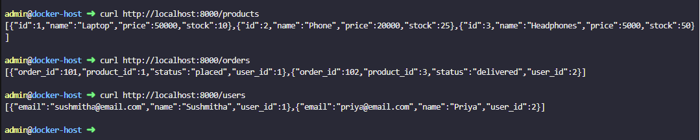
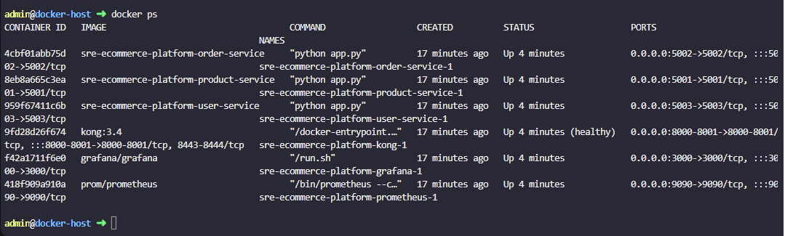
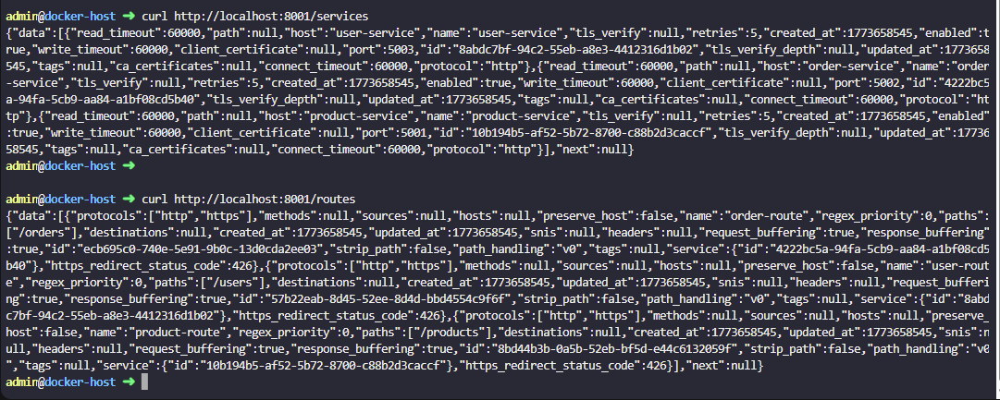
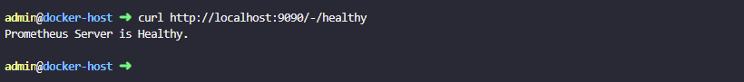
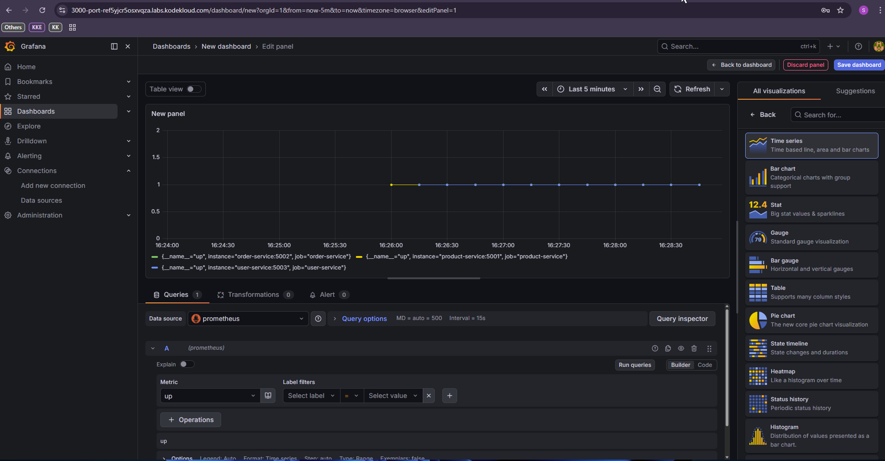
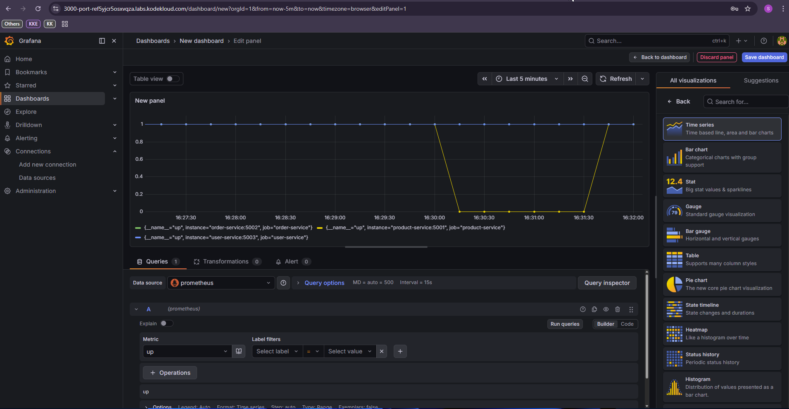

# SRE E-Commerce Platform — Phase 1: Containerization & Observability

A production-style e-commerce microservices platform demonstrating containerization, API gateway management, and observability — built to reflect real-world SRE practices.

## Architecture
```
User Request
     │
     ▼
Kong API Gateway (Port 8000)
     │
     ├──▶ Product Service (Port 5001)
     ├──▶ Order Service   (Port 5002)
     └──▶ User Service    (Port 5003)
          │
          ▼
     Prometheus (Port 9090)
          │
          ▼
     Grafana (Port 3000)
```

## Tech Stack

| Tool | Purpose |
|---|---|
| Python Flask | Microservices |
| Docker & Docker Compose | Containerization |
| Kong API Gateway | Routing, single entry point |
| Prometheus | Metrics collection |
| Grafana | Metrics visualisation |

## Services

| Service | Port | Endpoint |
|---|---|---|
| Product Service | 5001 | /products |
| Order Service | 5002 | /orders |
| User Service | 5003 | /users |
| Kong Gateway | 8000 | All traffic |
| Prometheus | 9090 | /metrics |
| Grafana | 3000 | Dashboard |

## How to Run
```bash
git clone https://github.com/SushmithaSudarshan/sre-ecommerce-platform.git
cd sre-ecommerce-platform/phase-1-docker-observability
docker-compose up --build
```

## What This Demonstrates

- **Containerization** — All services run in isolated Docker containers
- **API Gateway** — Kong routes all traffic, no direct service access
- **Observability** — Prometheus scrapes metrics every 15 seconds
- **Incident Simulation** — Service failure detected and recovered, captured on Grafana

## Incident Simulation

Simulated a production incident by stopping the Product Service:
```bash
docker stop sre-ecommerce-platform-product-service-1
```

Prometheus detected the service going down within 15 seconds.
Service was recovered by restarting the container:
```bash
docker start sre-ecommerce-platform-product-service-1
```

Full incident lifecycle captured on Grafana dashboard.

## Screenshots

### All Services Running Through Kong


### All Containers Healthy


### Kong Services & Routes Registered


### Prometheus Healthy


### Grafana — Service Health Dashboard


### Incident Simulation — Service Down & Recovery
