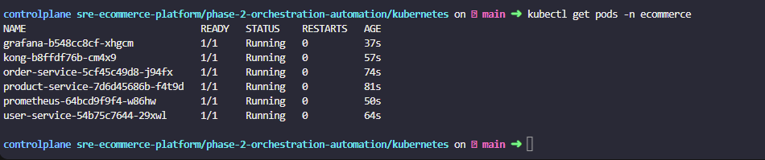
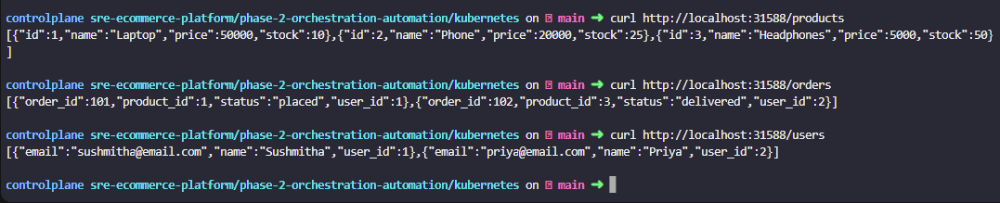
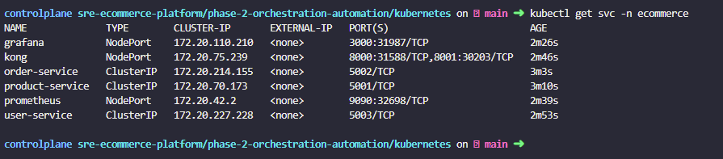
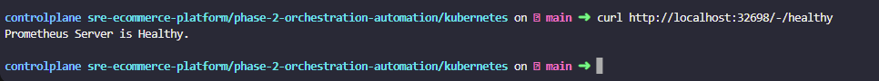
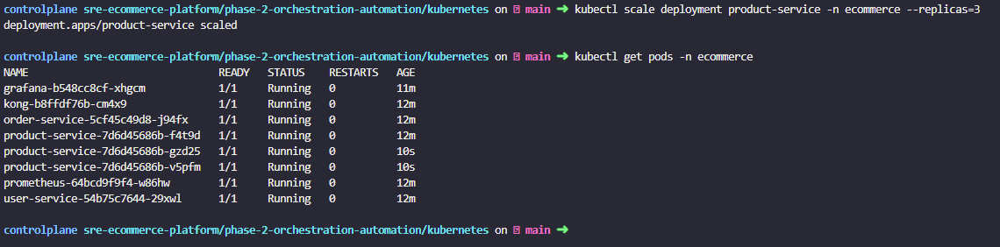
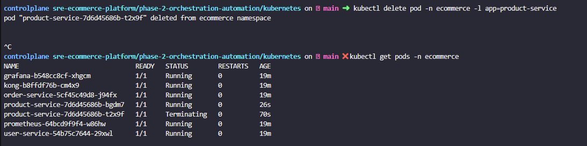

# Phase 2 — Orchestration & Automation

Migrates the Phase 1 platform from Docker Compose to Kubernetes, adds horizontal scaling, demonstrates self-healing, and automates the entire deployment with Ansible and Jenkins CI/CD.

## What's New in Phase 2

| Feature | Phase 1 | Phase 2 |
|---|---|---|
| Container Management | Docker Compose | Kubernetes |
| Scaling | Manual | `kubectl scale` |
| Self-healing | Manual restart | Automatic |
| Deployment | Manual commands | Ansible playbook |
| CI/CD | None | Jenkins pipeline |

## Structure
```
phase-2-orchestration-automation/
├── kubernetes/    # K8s manifests for all services
├── ansible/       # Automated deployment playbook
└── jenkins/       # CI/CD pipeline
```

## Kubernetes

### How to Deploy
```bash
git clone https://github.com/SushmithaSudarshan/sre-ecommerce-platform.git
cd sre-ecommerce-platform/phase-2-orchestration-automation/kubernetes
kubectl apply -f namespace.yml
kubectl apply -f product-service/
kubectl apply -f order-service/
kubectl apply -f user-service/
kubectl apply -f kong/
kubectl apply -f prometheus/
kubectl apply -f grafana/
```

### What This Demonstrates

- **Container Orchestration** — All services running as Kubernetes pods
- **API Gateway** — Kong routing via NodePort
- **Observability** — Prometheus monitoring all pods
- **Horizontal Scaling** — Scaled product service from 1 to 3 replicas
- **Self Healing** — Kubernetes automatically replaced deleted pod

## Screenshots

### All Pods Running


### Kong Routing Through Kubernetes


### All Services


### Prometheus Healthy


### Horizontal Scaling — 3 Replicas


### Self Healing — Pod Auto Recovery
