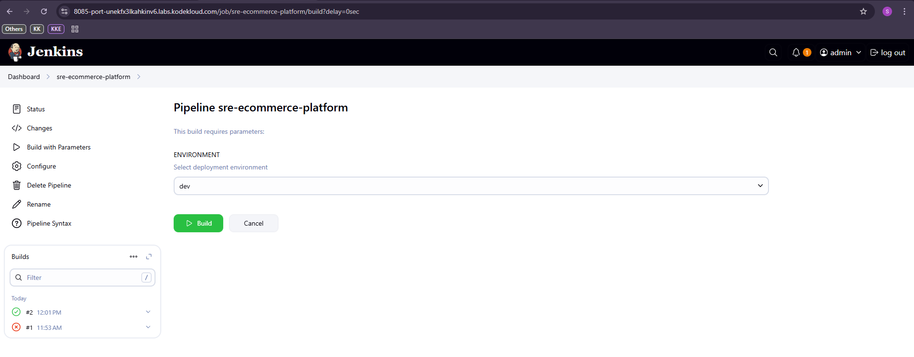
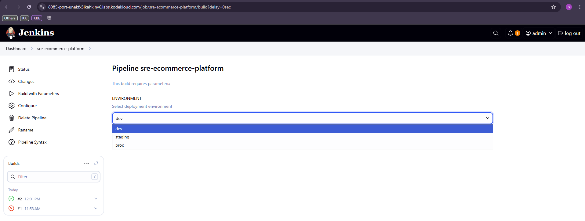
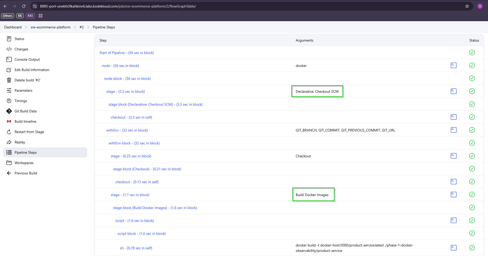
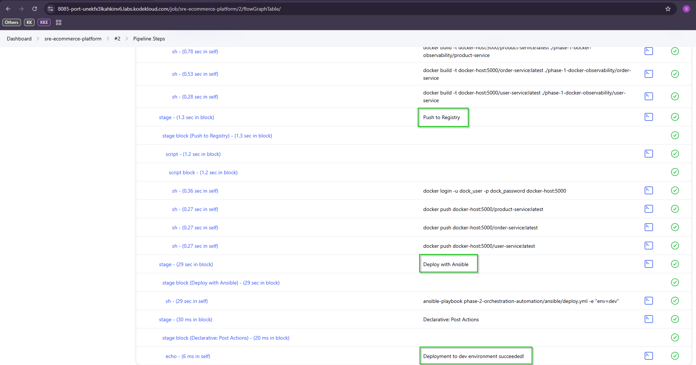
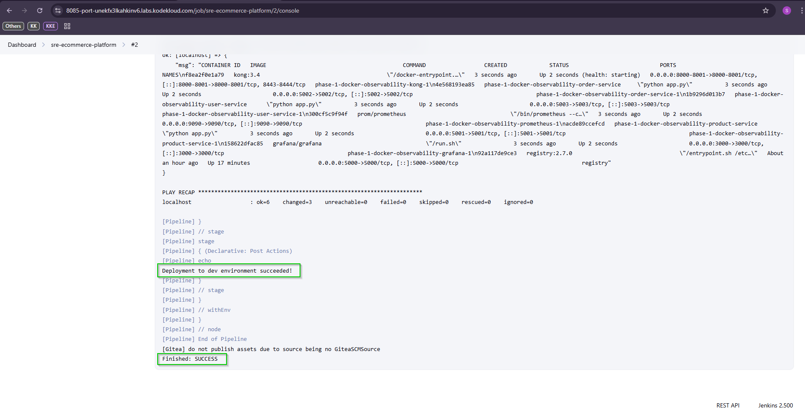

# Phase 2 — CI/CD & Automation

Automates the build, push and deployment of the e-commerce platform using Jenkins CI/CD pipeline and Ansible — eliminating manual steps from Phase 1.

## What's New in Phase 2

| Feature | Phase 1 | Phase 2 |
|---|---|---|
| Deployment | Manual `docker compose up` | Automated via Jenkins + Ansible |
| Build | Manual | Jenkins pipeline |
| Environment targeting | None | Dev / Staging / Prod parameter |
| Configuration management | Manual | Ansible playbook |

## Structure
```
phase-2-orchestration-automation/
├── ansible/     # Automated deployment playbook
└── jenkins/     # CI/CD pipeline
```

## How It Works
```
Developer pushes code
        ↓
Jenkins pipeline triggered
        ↓
Stage 1: Checkout code
        ↓
Stage 2: Build Docker images
        ↓
Stage 3: Push to registry
        ↓
Stage 4: Ansible deploys with environment parameter
        ↓
Platform running in containers
```

## Jenkins Pipeline

Parameterised pipeline with environment selection:
```groovy
parameters {
    choice(
        name: 'ENVIRONMENT',
        choices: ['dev', 'staging', 'prod'],
        description: 'Select deployment environment'
    )
}
```

## Ansible Playbook

Single command deploys entire platform:
```bash
ansible-playbook ansible/deploy.yml -e "env=dev"
```

## Screenshots

### Jenkins — Build with Parameters


### Jenkins — Environment Selection (dev/staging/prod)


### Jenkins — Pipeline Steps (Checkout & Build)


### Jenkins — Pipeline Steps (Push & Deploy)


### Jenkins — Console Output Success
