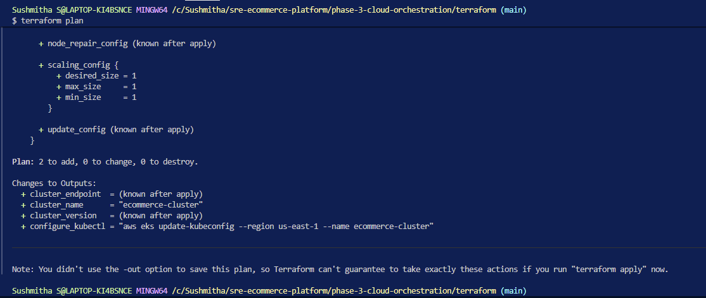
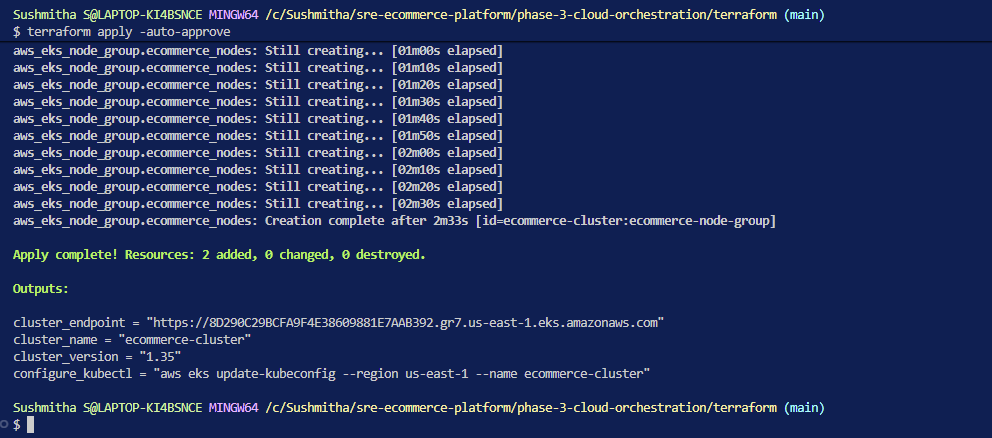
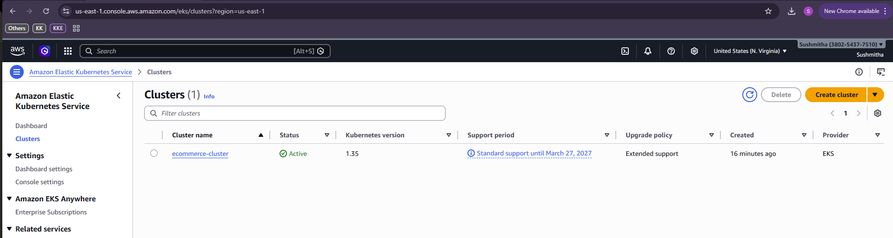
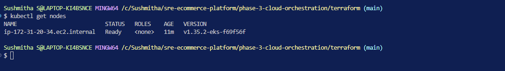
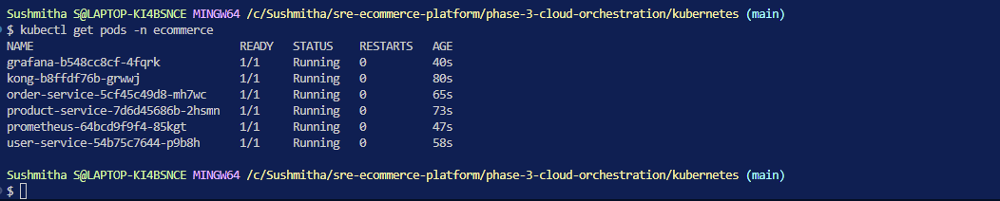
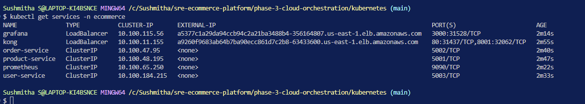
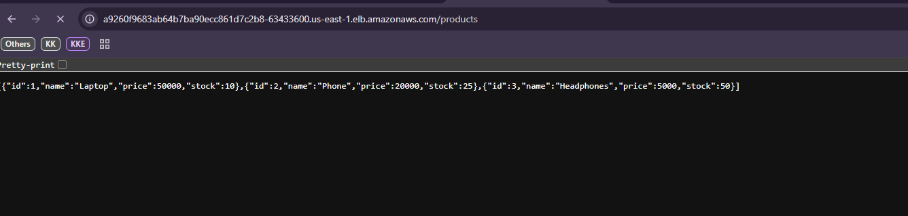
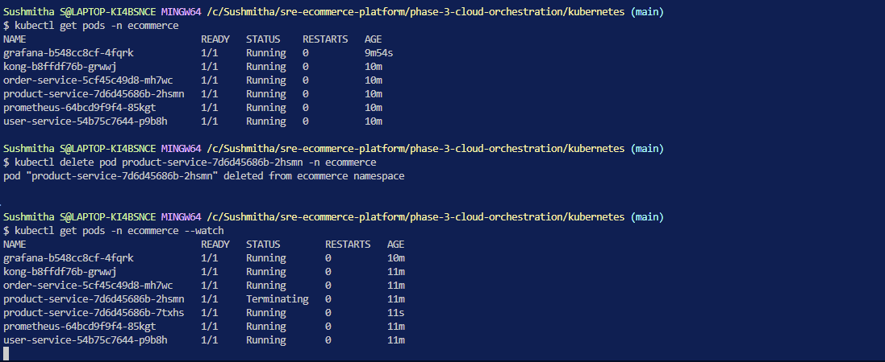
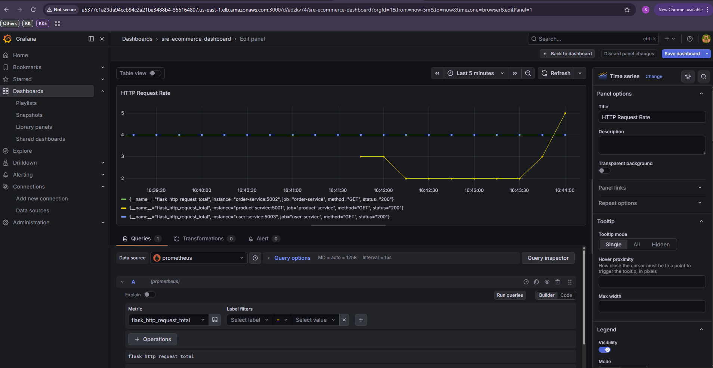
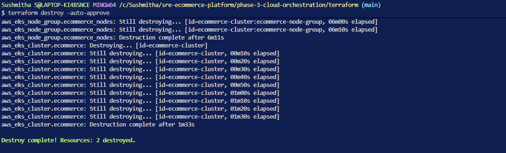

# Phase 3 — Cloud & Orchestration

## Overview
Phase 3 migrates the SRE E-Commerce Platform from a single Docker host 
(Phase 1) to production-grade cloud infrastructure on AWS EKS, provisioned 
using Terraform as Infrastructure as Code.

## What This Phase Demonstrates
- Infrastructure as Code with Terraform
- AWS EKS cluster provisioning
- Kubernetes deployment of all microservices
- Cloud-native observability with Prometheus + Grafana
- Self-healing incident simulation on Kubernetes

## Architecture
```
Terraform (IaC)
    → AWS EKS Cluster (1x t3.small node)
        → Kubernetes Namespace: ecommerce
            ├── Kong API Gateway (LoadBalancer — public entry point)
            ├── Product Service (ClusterIP — internal)
            ├── Order Service (ClusterIP — internal)
            ├── User Service (ClusterIP — internal)
            ├── Prometheus (ClusterIP — internal scraping)
            └── Grafana (LoadBalancer — dashboard access)
```

## Tech Stack
| Tool | Purpose |
|---|---|
| Terraform | Provision AWS EKS cluster |
| AWS EKS | Managed Kubernetes |
| Kubernetes | Container orchestration |
| kubectl | Deploy and manage K8s resources |
| Kong API Gateway | Single entry point, DBless mode |
| Prometheus | Metrics scraping |
| Grafana | Metrics visualisation |

## Key Decisions
- **t3.small, single node** — minimal cost for demo purposes
- **Kong as LoadBalancer** — public entry point on port 80
- **Prometheus as ClusterIP** — internal only, Grafana talks to it directly
- **Grafana as LoadBalancer** — browser access for dashboards
- **IAM roles created manually** — foundational infrastructure, created once
  and referenced by Terraform. In an automated setup these would live in a
  separate Terraform foundation layer.
- **Docker Hub images** — used for simplicity. In production, images would
  be stored in ECR for private access and faster pulls within the AWS VPC.

## Migration from Phase 1/2
| | Phase 1 | Phase 3 |
|---|---|---|
| Infrastructure | Single Docker host | AWS EKS cluster |
| Deployment | `docker compose up` | `kubectl apply` |
| Scaling | Manual, single host | Auto-scaling node groups |
| Self-healing | No | Yes — K8s restarts failed pods |
| Networking | localhost | AWS Load Balancer, public URLs |
| IaC | None | Terraform |

## How to Run

### Prerequisites
- AWS account with `eksClusterRole` and `AmazonEKSNodeRole` created
- AWS CLI configured (`aws configure`)
- Terraform installed
- kubectl installed

### Step 1 — Provision Infrastructure
```bash
cd phase-3-cloud-orchestration/terraform
terraform init
terraform plan
terraform apply -auto-approve
```

### Step 2 — Connect kubectl
```bash
aws eks update-kubeconfig --region us-east-1 --name ecommerce-cluster
kubectl get nodes
```

### Step 3 — Deploy Microservices
```bash
cd ../kubernetes
kubectl apply -f namespace.yml
kubectl apply -f kong/configmap.yml
kubectl apply -f kong/deployment.yml
kubectl apply -f kong/service.yml
kubectl apply -f product-service/deployment.yml
kubectl apply -f product-service/service.yml
kubectl apply -f order-service/deployment.yml
kubectl apply -f order-service/service.yml
kubectl apply -f user-service/deployment.yml
kubectl apply -f user-service/service.yml
kubectl apply -f prometheus/configmap.yml
kubectl apply -f prometheus/deployment.yml
kubectl apply -f prometheus/service.yml
kubectl apply -f grafana/deployment.yml
kubectl apply -f grafana/service.yml
```

### Step 4 — Verify
```bash
kubectl get pods -n ecommerce
kubectl get services -n ecommerce
```

### Step 5 — Access Services
```
Kong API Gateway: http://<kong-external-ip>/products
                  http://<kong-external-ip>/orders
                  http://<kong-external-ip>/users
Grafana:          http://<grafana-external-ip>:3000
```

## Incident Simulation
To demonstrate Kubernetes self-healing:
```bash
# Get pod name
kubectl get pods -n ecommerce

# Kill product service pod
kubectl delete pod <product-service-pod-name> -n ecommerce

# Watch K8s restart it automatically
kubectl get pods -n ecommerce --watch
```

Prometheus captures the downtime and Grafana visualises the recovery blip.

## Screenshots
### Terraform Plan


### Terraform Apply


### EKS Cluster in AWS Console


### kubectl get nodes


### All Pods Running


### Services with Load Balancer URLs


### Kong API Response in Browser


### Incident Simulation — Pod Self-Healing


### Grafana — Incident Captured


### Terraform Destroy


> Always run `terraform destroy` after demos to avoid unnecessary charges.

## Cleanup
```bash
kubectl delete namespace ecommerce
cd ../terraform
terraform destroy -auto-approve
```