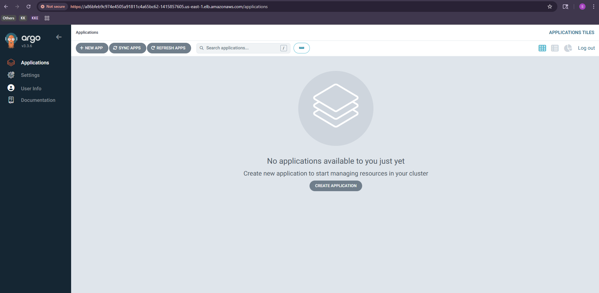
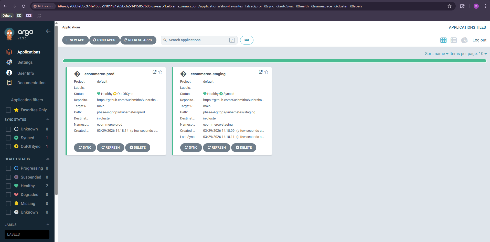
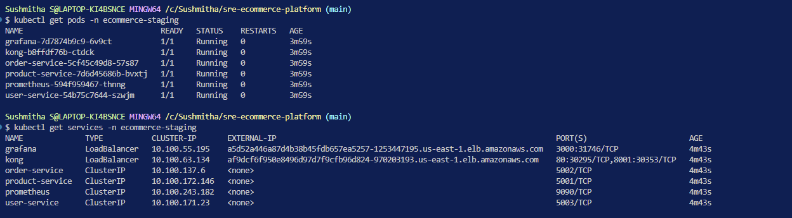
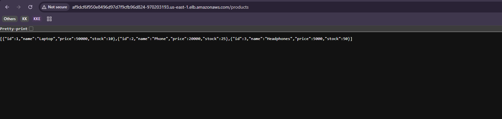
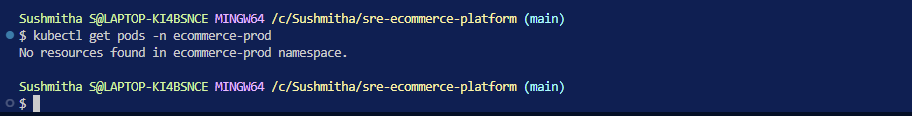
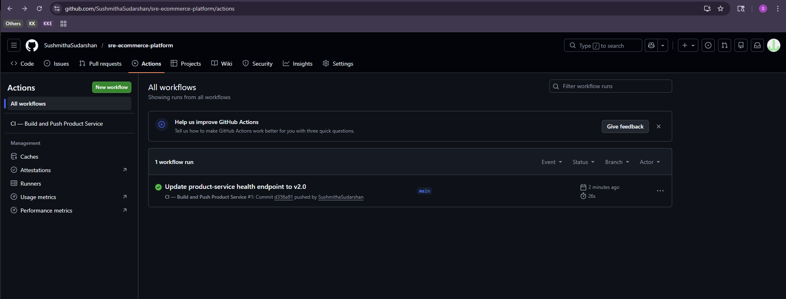
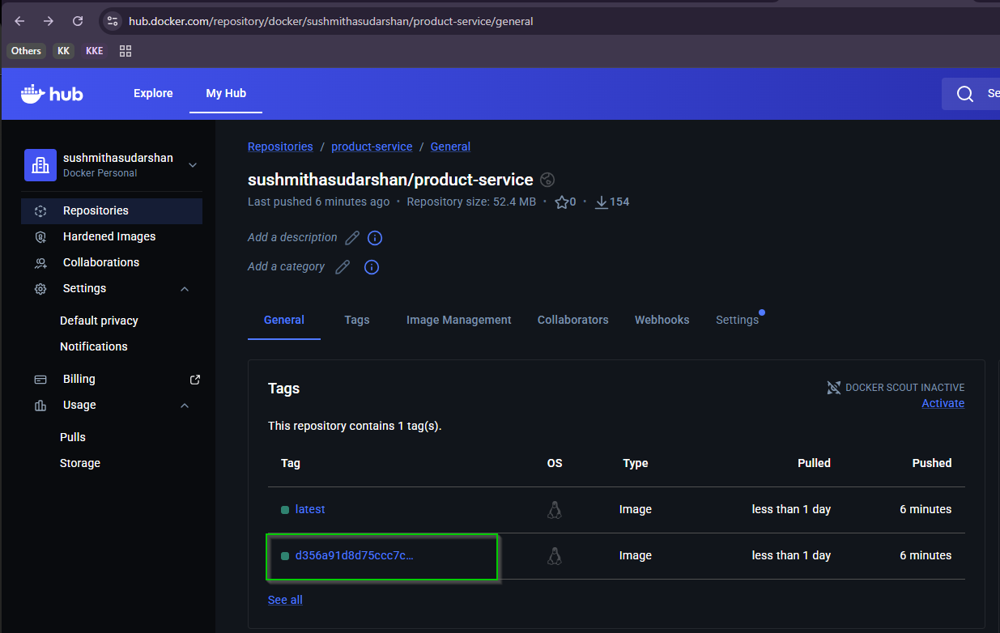
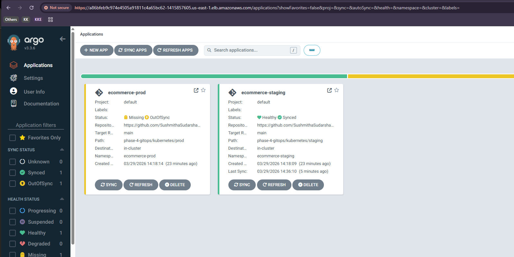
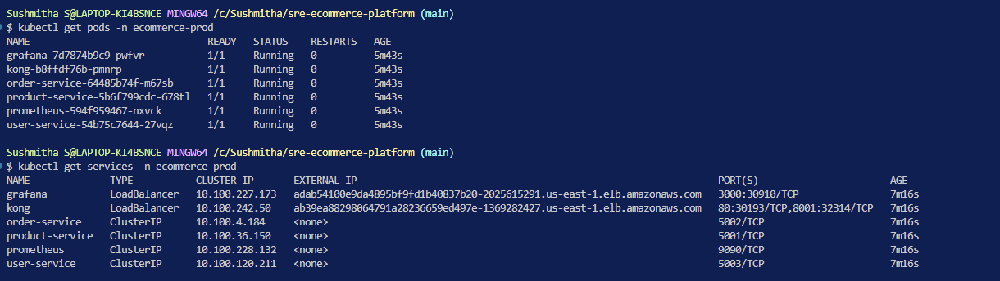
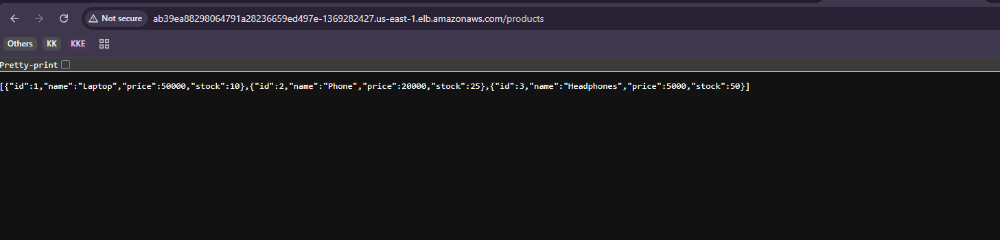

# Phase 4 — GitOps

## Overview
Phase 4 implements a full GitOps pipeline for the SRE E-Commerce Platform.
Every code change automatically triggers a build, pushes a new image, and
deploys to staging. Production deployments require a manual approval gate
in ArgoCD — protecting production from untested changes.

## What This Phase Demonstrates
- GitOps principles — Git as single source of truth
- GitHub Actions CI pipeline — automated image build and push
- ArgoCD CD pipeline — automated staging deployment
- Environment promotion — staging to prod with manual approval gate
- Two isolated environments on the same EKS cluster

## Architecture
```
Developer pushes code
    → GitHub Actions triggers
        → Builds product-service Docker image
            → Pushes to Docker Hub (latest + commit SHA tag)
                → Updates K8s manifests with new image tag
                    → Commits manifest change back to repo
                        → ArgoCD detects change
                            → Auto-deploys to staging
                                → SRE reviews staging
                                    → Manual sync in ArgoCD UI
                                        → Deploys to production
```

## Tech Stack
| Tool | Purpose |
|---|---|
| GitHub Actions | CI — builds and pushes image on every code push |
| ArgoCD | CD — watches repo, syncs cluster automatically |
| Docker Hub | Image registry with commit SHA tags |
| AWS EKS | Kubernetes cluster (same as Phase 3) |
| kubectl | Cluster management |

## Environments
| Environment | Namespace | Sync Policy | Entry Point |
|---|---|---|---|
| Staging | `ecommerce-staging` | Auto — deploys on every push | Kong LoadBalancer |
| Production | `ecommerce-prod` | Manual — requires approval in ArgoCD UI | Kong LoadBalancer |

## Key Decisions
- **Commit SHA image tags** — every push creates a unique tag. ArgoCD
  detects the manifest change and syncs. Using `latest` alone would not
  trigger ArgoCD since the tag never changes.
- **Auto-sync on staging** — immediate feedback on every code change.
- **Manual sync on prod** — protects production from untested changes.
  The missing `automated` block in `app-prod.yml` is the approval gate.
- **Same EKS cluster, two namespaces** — cost efficient for a demo.
  In production, staging and prod would typically be separate clusters.
- **Only product-service rebuilt** — order and user services stay on
  `latest`. In production, each service would have its own pipeline.
- **Docker Hub over ECR** — simplicity for demo. In production, ECR
  would be used for private access and faster pulls within the AWS VPC.

## CI Pipeline — GitHub Actions
Triggers on push to `main` when files inside `product-service/` change.
```
Checkout code
    → Login to Docker Hub
        → Build product-service image
            → Push with commit SHA tag + latest tag
                → Update image tag in staging + prod manifests
                    → Commit and push manifest changes
```

## CD Pipeline — ArgoCD
Two ArgoCD applications watching the same repo, different paths:

| App | Path | Sync |
|---|---|---|
| `ecommerce-staging` | `phase-4-gitops/kubernetes/staging` | Automated |
| `ecommerce-prod` | `phase-4-gitops/kubernetes/prod` | Manual |

## How to Run

### Prerequisites
- EKS cluster running (see Phase 3)
- kubectl connected to cluster

### Step 1 — Install ArgoCD
```bash
kubectl create namespace argocd
kubectl apply -n argocd -f https://raw.githubusercontent.com/argoproj/argo-cd/stable/manifests/install.yaml
kubectl patch svc argocd-server -n argocd -p '{"spec": {"type": "LoadBalancer"}}'
```

### Step 2 — Get ArgoCD UI URL and Password
```bash
kubectl get svc argocd-server -n argocd
kubectl get secret argocd-initial-admin-secret -n argocd -o jsonpath="{.data.password}" | base64 -d
```

### Step 3 — Deploy ArgoCD Applications
```bash
kubectl apply -f phase-4-gitops/argocd/app-staging.yml
kubectl apply -f phase-4-gitops/argocd/app-prod.yml
```

### Step 4 — Trigger the Pipeline
Make a code change to `phase-1-docker-observability/product-service/` and push to main. GitHub Actions triggers automatically.

### Step 5 — Approve Production
Once staging is healthy, go to ArgoCD UI → `ecommerce-prod` → **Sync** → **Synchronize**.

### Step 6 — Verify
```bash
kubectl get pods -n ecommerce-staging
kubectl get pods -n ecommerce-prod
kubectl get services -n ecommerce-staging
kubectl get services -n ecommerce-prod
```

## Screenshots

### ArgoCD UI — Logged In


### Both Apps Registered — Staging Synced, Prod Waiting


### Staging Pods and Services Running


### Staging Kong API Live in Browser


### Prod Empty — Manual Gate Working


### GitHub Actions — Pipeline Complete


### Docker Hub — Commit SHA Image Tag Pushed


### ArgoCD — Staging Auto-Updated, Prod Still Waiting


### Prod Pods and Services Running After Approval


### Prod Kong API Live in Browser


## Cleanup
```bash
kubectl delete namespace ecommerce-staging
kubectl delete namespace ecommerce-prod
kubectl delete namespace argocd
cd ../phase-3-cloud-orchestration/terraform
terraform destroy -auto-approve
```